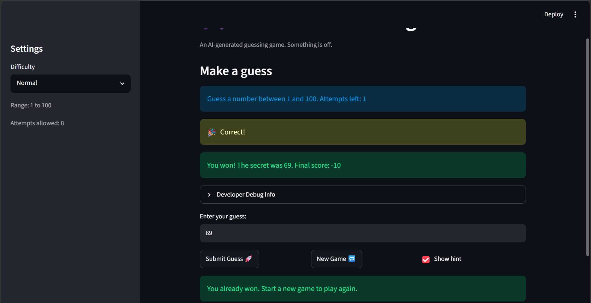

# 🎮 Game Glitch Investigator: The Impossible Guesser

## 🚨 The Situation

You asked an AI to build a simple "Number Guessing Game" using Streamlit.
It wrote the code, ran away, and now the game is unplayable. 

- You can't win.
- The hints lie to you.
- The secret number seems to have commitment issues.

## 🛠️ Setup

1. Install dependencies: `pip install -r requirements.txt`
2. Run the broken app: `python -m streamlit run app.py`

## 🕵️‍♂️ Your Mission

1. **Play the game.** Open the "Developer Debug Info" tab in the app to see the secret number. Try to win.
2. **Find the State Bug.** Why does the secret number change every time you click "Submit"? Ask ChatGPT: *"How do I keep a variable from resetting in Streamlit when I click a button?"*
3. **Fix the Logic.** The hints ("Higher/Lower") are wrong. Fix them.
4. **Refactor & Test.** - Move the logic into `logic_utils.py`.
   - Run `pytest` in your terminal.
   - Keep fixing until all tests pass!

## 📝 Document Your Experience

- [ ] Describe the game's purpose: Guess a number in detail in differing settings from easy, normal,  hard difficulty. 
- [ ] Detail which bugs you found: inccorect hints, incorrect attempts, incorrect difficulty rangem unreset score/status/history
- [ ] Explain what fixes you applied:
   - Reverse high/low hints so messages point the right direction
   - Start attempts at 0 to fix off-by-one in "attempts left"
   - Show the difficulty's actual range so main panel matches sidebar
   - Reset score/status/history and draw secret from difficulty range on New Game
   - Compare against the integer secret to remove the string-cast glitch
   - Queue feedback in session_state so messages persist across reruns

## 📸 Demo Walkthrough

Describe your fixed game in numbered steps so a reader can follow along without watching a video:

1. Pick a difficulty in the sidebar and confirm the main panel's "Guess a number between X and Y" matches the sidebar range.
2. Note that "Attempts left" starts at the full limit (no off-by-one) before any guess.
3. Submit a guess that is too low and verify the hint says "Go HIGHER!"; submit one too high and verify it says "Go LOWER!".
4. Open "Developer Debug Info" and confirm the secret number stays the same across submits.
5. Watch each feedback message stay visible after a guess instead of disappearing on rerun.
6. Keep guessing until you win and see the celebration plus the final score.
7. Click "New Game" and confirm score, attempts, and history reset and a new secret is drawn from the chosen range.

**Screenshot** *(optional)*: <!-- Insert a screenshot of your fixed, winning game here -->

## 🧪 Test Results

```
# Paste your pytest output here, e.g.:
# pytest tests/
# ========================= 8 passed in 0.03s =========================
```

## 🚀 Stretch Features

- [ ] [If you choose to complete Challenge 4, describe the Enhanced UI changes here — a screenshot is optional]
